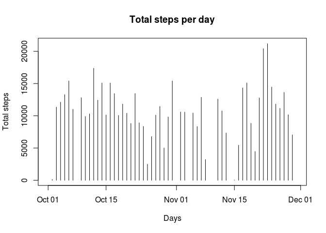
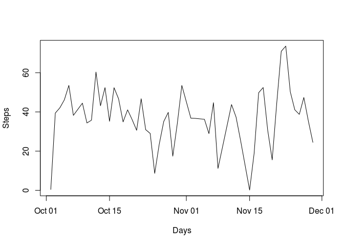
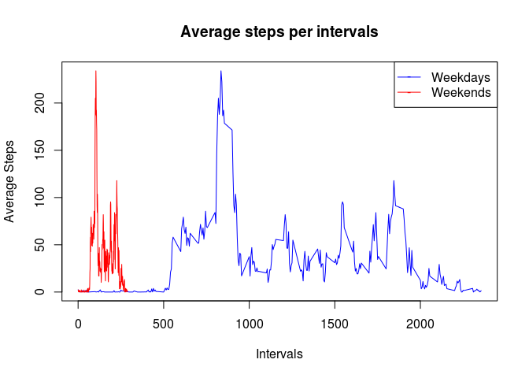

# Reproducible Research: Peer Assessment 1


## Loading and preprocessing the data

```r
dataUrl <- 'https://d396qusza40orc.cloudfront.net/repdata%2Fdata%2Factivity.zip'
zipFile <- 'activity.zip'
csvFile <- 'activity.csv'

# Download the file only if necessary
if ((file.exists(zipFile) == FALSE) & (file.exists(csvFile) == FALSE)) {
  download.file(dataUrl, zipFile)
}

# Unzip the zip file only if necessary.
if (file.exists(csvFile) == FALSE){
  unzip(zipFile)
}

# Load data from file
activityData <- read.csv(csvFile, na.strings = 'NA')
```


## What is mean total number of steps taken per day?

```r
# Get the list of all the unique dates the data were collected
alldays <- unique(activityData$date)

total_steps <- c()

# Build a list of total steps per day
for (day in alldays) {
  activityDataPerDay <- subset(activityData, date == day)
  total_steps <- c(total_steps, sum(activityDataPerDay$steps))
}

# Create an histogram in for the total steps per day
plot(as.Date(alldays), total_steps, type = 'h', xlab='Days', ylab='Total steps',
     main='Total steps per day')
```



```r
mean(total_steps, na.rm = TRUE)
```

```
## [1] 10766.19
```
The mean total number of steps per day is: 10766.19

## The 5-minute interval with the maximum number of steps is has 615 steps

```r
index_max_number_of_steps <- which(activityData$steps == max(activityData$steps, na.rm = TRUE))
print(activityData$interval[index_max_number_of_steps])
```

```
## [1] 615
```

## Imputing missing values

```r
# Since missing data are NA, we want to subset all the data where the steps is not NA
clean_activityData <- subset(activityData, is.na(activityData$steps) == FALSE)
```

## What is the average daily activity pattern?

```r
# Since missing data are NA, we want to subset all the data where the steps is not NA
clean_activityData <- subset(activityData, is.na(activityData$steps) == FALSE)

# Refresh the list of all the unique dates the data were collected, with missing data removed
alldays <- unique(clean_activityData$date)

total_steps <- c()
mean_steps <- c()
median_steps <- c()

# Build 3 vectors of respectively mean, median and total steps per day, with missing data removed
for (day in alldays) {
  activityDataPerDay <- subset(clean_activityData, date == day)
  mean_steps <- c(mean_steps, mean(activityDataPerDay$steps))
  median_steps <- c(median_steps, median(activityDataPerDay$steps))
  total_steps <- c(total_steps, sum(activityDataPerDay$steps))
}

mean_and_mediandf <- data.frame('Mean_Steps'= mean_steps, 'Median_Steps'= median_steps, 'date' = unique(clean_activityData$date))
mean_and_mediandf$date <- as.Date(mean_and_mediandf$date)

# Plot the average steps per day and the median steps per day

with(mean_and_mediandf, plot(date, Mean_Steps, type = 'l', xlab = 'Days', ylab = 'Steps'))
points(mean_and_mediandf$Median_Steps, type = 'l', col='red')
```



From the histogram, we cannot really tell whether or not there is a pattern. It looks like there are
more steps per day towards the end of the month. We can observe that after with a high number of steps,
there is a day with lower than average number of steps


## Are there differences in activity patterns between weekdays and weekends?

```r
# Define a function that returns 'weekend' when the date is a weekend (Sunday or Saturday);
# otherwise 'weekday'

convert_to_weekday_weekend <- function(d){
  if (weekdays(d) == 'Sunday' | weekdays(d) == 'Saturday'){
    return ('weekend')
  } else {
    return ('weekday')
  }
}

# Create a vector that says the type of day (weekday or weekend) and add that vector as a column of
# the data frame
typeOfDay <- lapply(as.Date(clean_activityData$date), convert_to_weekday_weekend)

library('dplyr')
clean_activityData <- mutate(clean_activityData, dayType = typeOfDay)

print(head(clean_activityData), 10)
```

```
##   steps       date interval dayType
## 1     0 2012-10-02        0 weekday
## 2     0 2012-10-02        5 weekday
## 3     0 2012-10-02       10 weekday
## 4     0 2012-10-02       15 weekday
## 5     0 2012-10-02       20 weekday
## 6     0 2012-10-02       25 weekday
```

```r
# Get the list of all unique intervals  
allintervals <- unique(clean_activityData$interval)
average_steps_weekday <- c()
average_steps_weekend <- c()

# Calculate the total average of steps per interval per type of day
for (curr_interval in allintervals) {
  activityDataPerIntervalOnWeekday <- subset(clean_activityData, interval == curr_interval & dayType == 'weekday')
  activityDataPerIntervalOnWeekend <- subset(clean_activityData, interval == curr_interval & dayType != 'weekend')
  average_steps_weekday <- c(average_steps_weekday, mean(activityDataPerIntervalOnWeekday$steps))
  average_steps_weekend <- c(average_steps_weekend, mean(activityDataPerIntervalOnWeekend$steps))
}

# Plot the average steps per interval on the weekdays and on the weekends
plot(allintervals, average_steps_weekday, type = 'l', xlab = 'Intervals', ylab = 'Average Steps', col = 'blue',
     main = 'Average steps per intervals')
points(average_steps_weekend, type = 'l', col='red')
legend('topright', pch=c('-','-'), lty=c(1,1), col=c('blue', 'red'), 
       legend=c('Weekdays', 'Weekends'))
```



During the weekends, there are more activities early during the day. They are around the intervals 0 to about 300.
During the weekends, the average steps is very low until around interval 10 and they reach a peak around interval 800


